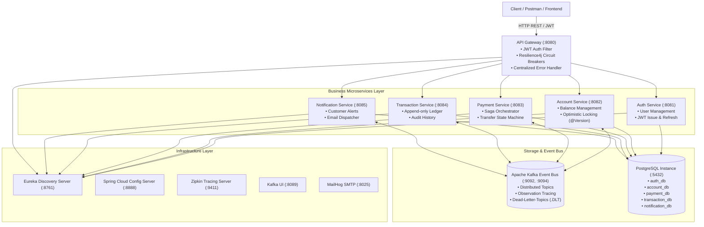
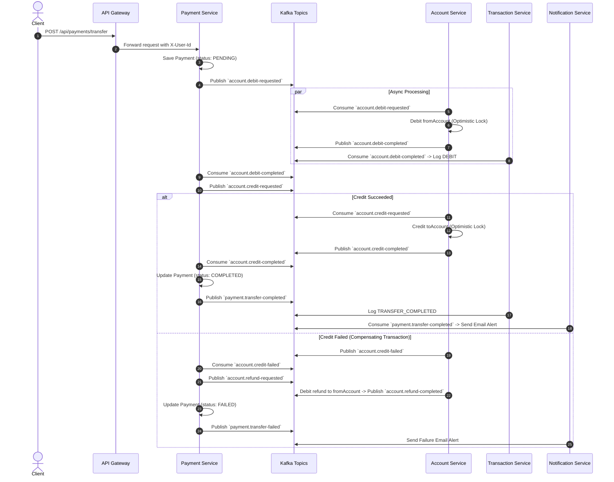

# 🏦 Banking Microservices Platform

[](https://openjdk.org/)
[](https://spring.io/projects/spring-boot)
[](https://spring.io/projects/spring-cloud)
[](https://kafka.apache.org/)
[](https://www.postgresql.org/)
[](https://resilience4j.readme.io/)
[](https://zipkin.io/)
[](.github/workflows/ci.yml)

An enterprise-grade, distributed **Banking Microservices Platform** built with **Java 25**, **Spring Boot 4.1.x**, and **Spring Cloud 2025.1.x**. This project demonstrates end-to-end event-driven architecture, choreographic & orchestrated Saga distributed transaction patterns, optimistic concurrency locking, distributed tracing, circuit breaker fault-tolerance, Kafka idempotency, and comprehensive centralized exception handling.

---

## 🏛️ System Architecture



---

## 🔄 Distributed Saga Transaction Pattern (Money Transfer Flow)

The money transfer flow is implemented via an **Event-Driven Saga Pattern** with automatic compensating actions (refunds) upon failure, avoiding slow 2PC distributed locking:



---

## 🛠️ Microservices & Tech Stack Overview

| Service | Port | Database | Primary Responsibility |
|---|---|---|---|
| **`eureka-server`** | `8761` | — | Dynamic Service Registry & Discovery |
| **`config-server`** | `8888` | — | Centralized Configuration Management (Native repository) |
| **`api-gateway`** | `8080` | — | Reactive Routing, JWT Authentication Filter, Resilience4j Circuit Breaker |
| **`auth-service`** | `8081` | PostgreSQL (`auth_db`) | User Registration, BCrypt password hashing, JWT Access/Refresh tokens |
| **`account-service`** | `8082` | PostgreSQL (`account_db`) | Bank accounts, `@Version` optimistic locking debit/credit operations |
| **`payment-service`** | `8083` | PostgreSQL (`payment_db`) | Saga Orchestration, payment lifecycle, compensating transactions |
| **`transaction-service`** | `8084` | PostgreSQL (`transaction_db`) | Immutable append-only audit ledger for transactions |
| **`notification-service`** | `8085` | PostgreSQL (`notification_db`) | Idempotent email notifications via MailHog / JavaMail |
| **`zipkin`** | `9411` | In-memory / Storage | Micrometer Brave distributed trace UI & span visualizer |

---

## 🛡️ Cross-Cutting Concerns & Production-Ready Patterns

### 1. Centralized Exception Handling
- Unified JSON error schema across all services:
  ```json
  {
    "timestamp": "2026-09-28T07:15:00.123Z",
    "status": 400,
    "error": "Bad Request",
    "message": "Validation failed",
    "fields": { "amount": "must be greater than 0" }
  }
  ```
- Handled at both **API Gateway** (`GatewayErrorWebExceptionHandler` on WebFlux) and downstream services (`@RestControllerAdvice`).

### 2. Distributed Tracing (Micrometer Tracing + Zipkin)
- Request traces (`traceId`, `spanId`) are automatically propagated across synchronous HTTP calls and asynchronous Kafka topics via `spring.kafka.template.observation-enabled: true`.
- View distributed span visualizer at [http://localhost:9411](http://localhost:9411).

### 3. Fault Tolerance & Resilience (Resilience4j + Kafka DLT)
- **API Gateway Circuit Breaker**: Routes are wrapped in Resilience4j reactive circuit breakers. In case of downstream service degradation, requests fallback to `/fallback/{service}` with `503 Service Unavailable`.
- **Kafka Consumer Retry & Dead Letter Topics**: `DefaultErrorHandler` configured with `FixedBackOff(1000L, 3)` and `DeadLetterPublishingRecoverer` to automatically publish unrecoverable messages to `<topic>.DLT`.

### 4. Consumer Idempotency
- All Kafka consumers check the `ProcessedEvent` repository (`existsById(eventId)`) to avoid double debits/credits or duplicate emails if messages are redelivered.

---

## 🚀 Quickstart & Local Execution

### Prerequisites
- **Java 25 JDK** (`JAVA_HOME` pointing to JDK 25)
- **Docker & Docker Compose**

### Step 1: Start Infrastructure Containers
```bash
docker compose up -d
```
*Spins up PostgreSQL (with 5 databases), Kafka KRaft, Kafka UI, MailHog, and Zipkin.*

### Step 2: Start Microservices (in separate terminals or IDE)
```bash
# 1. Config & Registry
./gradlew :config-server:bootRun
./gradlew :eureka-server:bootRun

# 2. Business Services
./gradlew :auth-service:bootRun
./gradlew :account-service:bootRun
./gradlew :payment-service:bootRun
./gradlew :transaction-service:bootRun
./gradlew :notification-service:bootRun

# 3. Gateway
./gradlew :api-gateway:bootRun
```

---

## 🧪 Testing & Postman Collection

### Automated Tests
```bash
# Run all unit and integration tests across all microservices
./gradlew test
```

### Postman Collection
Import the pre-configured Postman Collection:
📁 [`docs/postman_collection.json`](docs/postman_collection.json)

The collection includes automated tests that capture and propagate `accessToken`, `userId`, `senderAccountId`, `receiverAccountId`, and `paymentId` seamlessly across test steps.

### OpenAPI / Swagger UI Endpoints
- **Auth Service**: `http://localhost:8081/swagger-ui.html`
- **Account Service**: `http://localhost:8082/swagger-ui.html`
- **Payment Service**: `http://localhost:8083/swagger-ui.html`
- **Transaction Service**: `http://localhost:8084/swagger-ui.html`
- **Notification Service**: `http://localhost:8085/swagger-ui.html`

---

## 💡 Key Architectural Decisions & Interview Q&A

<details>
<summary><b>1. Why Saga Choreography/Orchestration instead of Two-Phase Commit (2PC)?</b></summary>
2PC requires distributed locks across heterogeneous databases and participants. In high-volume banking systems, this creates latency bottlenecks and single points of failure. The Saga pattern splits transactions into local acid transactions coordinated asynchronously via Kafka events with compensating transactions for rollbacks.
</details>

<details>
<summary><b>2. How is concurrency handled during simultaneous balance updates?</b></summary>
Account Service utilizes <b>Optimistic Concurrency Control</b> with JPA <code>@Version</code>. When concurrent transfers attempt to modify the same balance, Hibernate checks the version column, throwing an <code>OptimisticLockException</code> which is safely caught and retried/failed by the Saga orchestrator.
</details>

<details>
<summary><b>3. How do we guarantee Kafka Consumer Idempotency?</b></summary>
Each Kafka message carries a unique <code>eventId</code> (UUID). Consumers first query the <code>processed_events</code> table. If the event ID exists, the message is ignored. If not, the transaction is processed and the event ID is stored atomically.
</details>

---

## 📂 Project Structure

```
banking-microservices-demo/
├── .github/workflows/ci.yml       # GitHub Actions CI pipeline
├── docs/postman_collection.json   # Ready-to-import Postman collection
├── docker-compose.yml             # Postgres, Kafka, Kafka UI, MailHog, Zipkin
├── config-server/                 # Centralized cloud configurations
├── eureka-server/                 # Service discovery registry
├── api-gateway/                   # WebFlux gateway + JWT + Circuit Breaker
├── auth-service/                  # User auth + JWT management
├── account-service/               # Account balance + Optimistic locking
├── payment-service/               # Saga orchestrator + Testcontainers
├── transaction-service/           # Immutable transaction history
└── notification-service/          # Email notifications + Deduplication
```
